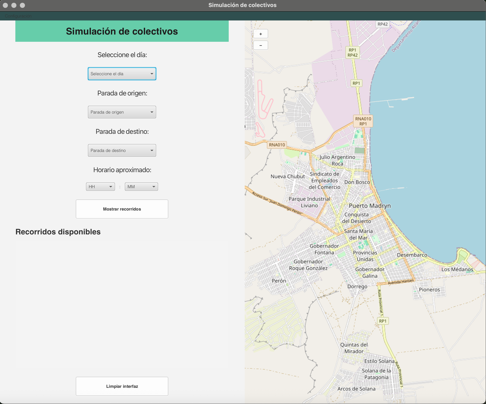

Sistema de Consulta de Colectivos
=================================

Este proyecto es una aplicación de escritorio desarrollada en Java que permite a los usuarios consultar horarios y recorridos de líneas de colectivos urbanos. La aplicación calcula la ruta óptima entre dos paradas, visualiza el recorrido en un mapa y ofrece una interfaz amigable para el usuario.

El sistema está diseñado para ser flexible, permitiendo obtener datos tanto desde archivos de texto locales como desde una base de datos PostgreSQL.

## Captura de Pantalla

Características Principales
---------------------------

*   **Interfaz Gráfica (JavaFX):** Interfaz de usuario intuitiva para seleccionar paradas de origen/destino, día de la semana y hora.
    
*   **Visualización en Mapa:** Muestra el recorrido calculado sobre un mapa interactivo.
    
*   **Cálculo de Recorridos:** Implementa la lógica de negocio para determinar la mejor ruta.
    
*   **Múltiples Fuentes de Datos:** Soporta la carga de datos desde:
    
    *   Archivos de texto (secuencial).
        
    *   Base de datos PostgreSQL.
        
*   **Internacionalización (i18n):** La interfaz está disponible en Español e Inglés.
    
*   **Logging:** Registra el historial de consultas utilizando **Log4j**.
    
*   **Tareas Asíncronas:** Las consultas se ejecutan en segundo plano (usando javafx.concurrent.Task, similar a SwingWorker) para mantener la interfaz fluida y receptiva.
    

Requisitos Previos
------------------

Para compilar y ejecutar este proyecto, necesitarás:

*   **Java JDK 21** (o superior).
    
*   **Apache Maven** (versión 3.6 o superior).
    
*   **PostgreSQL** (Opcional, solo si deseas utilizar la fuente de datos de base de datos).
    
*   Un IDE compatible con Java/Maven, como IntelliJ IDEA, Eclipse o VS Code con el "Extension Pack for Java".
    

Instalación y Ejecución
-----------------------

Sigue estos pasos para poner en marcha la aplicación:

### 1\. Clonar el Repositorio

`   git clone [URL_DE_TU_REPOSITORIO]  cd colectivo-base   `

### 2\. Configuración de la Fuente de Datos

Puedes elegir de dónde leerá los datos la aplicación (archivos de texto o base de datos) editando el archivo de configuración:

src/main/resources/factory.properties
`   # Para usar la base de datos, descomenta esta línea:  IMPLEMENTACION=BD  # Para usar los archivos de texto (lectura secuencial), descomenta esta línea:  # IMPLEMENTACION=SECUENCIAL   `

### 3\. Configuración de la Base de Datos (Opcional)

Si seleccionaste IMPLEMENTACION=BD, debes configurar tu base de datos PostgreSQL:

1.  **Crear la Base de Datos:** Crea una nueva base de datos en tu servidor PostgreSQL (ej. colectivos\_db).
    
2.  **Ejecutar Scripts:** Importa la estructura de tablas y los datos utilizando los scripts SQL proporcionados en el proyecto (probablemente en una carpeta /sql o /data).
    
3.  Propertiesdb.url=jdbc:postgresql://localhost:5432/colectivos\_dbdb.usuario=tu\_usuario\_postgresdb.contraseña=tu\_contraseña
    

### 4\. Compilar y Ejecutar con Maven

Una vez configurado, puedes compilar y ejecutar la aplicación usando Maven.
`   # 1. Compila el proyecto y descarga las dependencias  mvn clean install  # 2. Ejecuta la aplicación (requiere el plugin de JavaFX para Maven)  mvn javafx:run   `

Si javafx:run no funciona (depende de tu pom.xml), puedes ejecutar la clase principal directamente:
`   # Alternativa (reemplaza 'colectivo.app.AplicacionConsultas' con tu clase main)  mvn exec:java -Dexec.mainClass="colectivo.app.AplicacionConsultas"   `

Arquitectura y Patrones de Diseño
---------------------------------

El proyecto está estructurado siguiendo patrones de diseño clave para mantener un código limpio, modular y mantenible.

### Modelo-Vista-Controlador (MVC)

*   **Modelo:** Contiene las entidades de negocio (ej. Linea, Parada, Recorrido). Se encuentra en colectivo.modelo.
    
*   **Vista:** Compuesta por los archivos FXML (.fxml) y las clases de la interfaz gráfica (colectivo.ui.impl.javafx).
    
*   **Controlador:** Actúa como coordinador (CoordinadorApp) y gestiona la lógica de la interfaz (controladores JavaFX), conectando la Vista con los servicios.
    

### Data Access Object (DAO)

Se utiliza el patrón DAO para abstraer la lógica de persistencia de datos.

*   **Interfaces:** Se definen interfaces como LineaDAO, ParadaDAO, etc., en colectivo.persistencia.dao.
    
*   **Implementaciones:** Existen dos implementaciones concretas:
    
    1.  colectivo.persistencia.dao.secuencial: Lee los datos desde archivos de texto.
        
    2.  colectivo.persistencia.dao.bd: Lee los datos desde la base de datos PostgreSQL.
        

### Factory Method

Se utiliza una clase "Factory" (ubicada en colectivo.configuracion) para instanciar la implementación correcta de los DAO (Secuencial o BD) basándose en lo definido en el archivo factory.properties. Esto permite cambiar la fuente de datos de toda la aplicación sin modificar el código fuente.

### Sobre el Manual de Desarrollo

¡Genial que pienses en el manual de desarrollo!

Ese manual suele ser un documento más detallado que este README. Debería incluir:

1.  **Diagramas de Clases (UML):** Mostrando las relaciones entre las clases clave (Modelos, Servicios, DAOs).
    
2.  **Explicación del Flujo de Datos:** Cómo viaja una solicitud desde la UI (ej. "Buscar Recorrido") hasta el DAO y cómo vuelve.
    
3.  **Justificación de Diseño:** Por qué se eligió MVC, DAO, Factory y cómo se implementaron.
    
4.  **Guía para Añadir Nuevas Funcionalidades:** (Ej. "Cómo añadir una nueva entidad" o "Cómo añadir una nueva fuente de datos").
